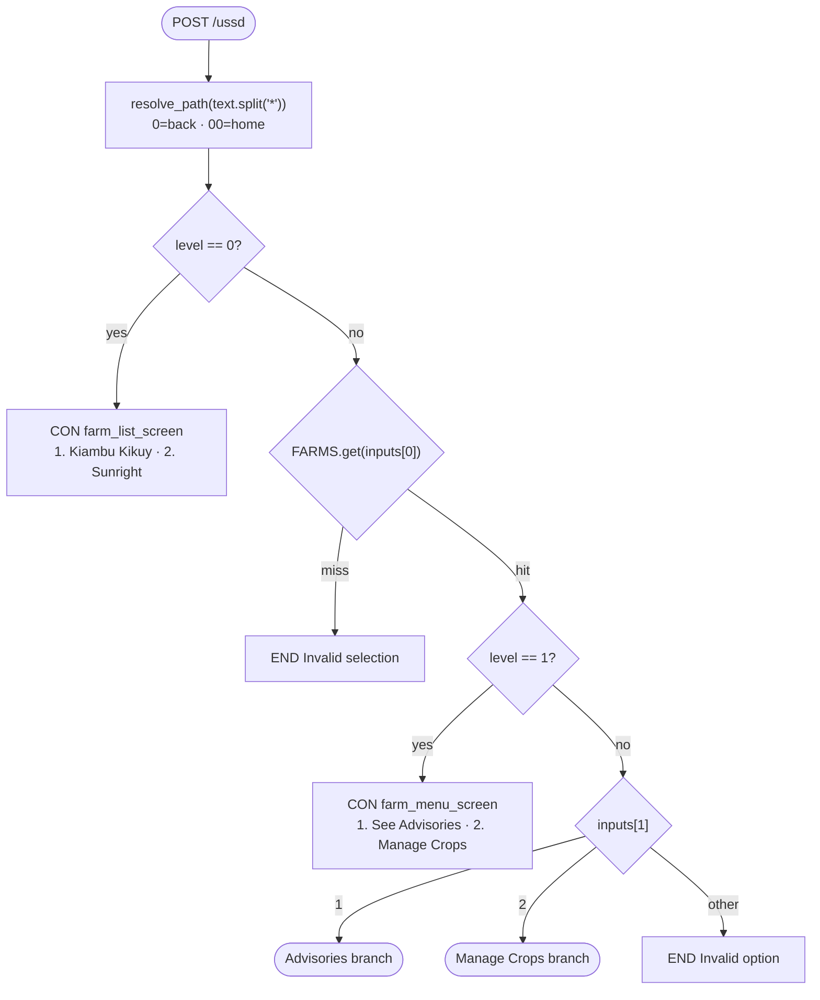
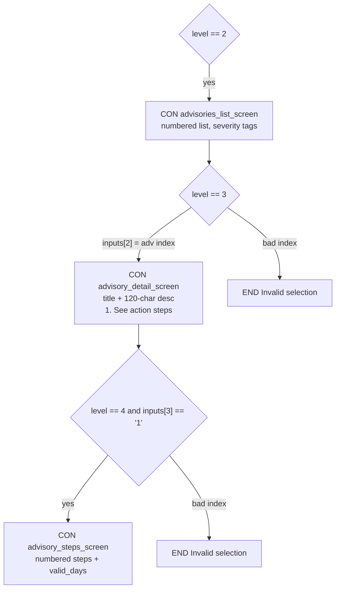
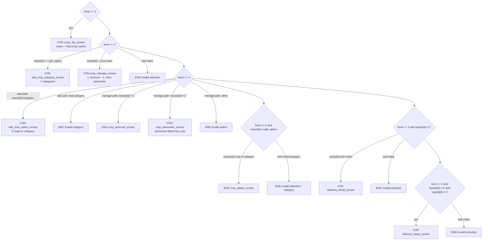

# USSD Flow

This document maps the complete menu tree implemented in `app.py`, derived from
`ussd_callback()` and the screen renderer functions.

## How to read this

- **`level`** = number of resolved inputs (`len(inputs)`), *after* `resolve_path()`
  has consumed any `0` (back) / `00` (home) tokens.
- **`inputs[n]`** = the value at each position of the resolved path.
- **CON** = session continues (menu shown). **END** = session terminates.
- Because `0`/`00` are consumed before routing, they are shown as global
  navigation, not per-screen edges — they simply shorten the path and re-render
  an earlier screen.

## Branch keys

| Position | Meaning |
|----------|---------|
| `inputs[0]` | Farm key (`1` Kiambu Kikuy, `2` Sunright) |
| `inputs[1]` | Farm menu choice (`1` Advisories, `2` Manage Crops) |
| `inputs[2]` | Advisory index **or** crop index / Add-Crop sentinel |
| `inputs[3]` | `1` See steps (advisories) **or** crop action / category key |
| `inputs[4]` | Crop-in-category index **or** crop-specific advisory index |
| `inputs[5]` | `1` See steps (crop-specific advisory) |

> **Note — dynamic "Add Crop" option:** in the Manage Crops branch, the sentinel
> `add_option = str(len(crops) + 1)`. For Kiambu (3 crops) it is `4`; for Sunright
> (2 crops) it is `3`. The same digit routes differently per farm.

## Top-level routing

## Advisories branch — `inputs[1] == "1"`

## Manage Crops branch — `inputs[1] == "2"`

`add_option = str(len(crops) + 1)` is the "Add Crop" sentinel at `inputs[2]`.

## Path examples

| Resolved `text` | Screen reached |
|-----------------|----------------|
| *(empty)* | Farm list (home) |
| `1` | Kiambu farm menu |
| `1*1` | Kiambu advisories list |
| `1*1*3` | 3rd advisory detail |
| `1*1*3*1` | 3rd advisory action steps |
| `1*2` | Kiambu crops list |
| `1*2*4` | Add Crop → category list (Kiambu: `add_option == 4`) |
| `1*2*4*5*1` | Added "Avocado" (Fruits → first crop) — `END` |
| `1*2*1*1` | Removed crop #1 — `END` |
| `1*2*1*2*1*1` | Crop #1 → its advisories → 1st advisory → steps |
| `1*1*0` | Back from advisories list → Kiambu farm menu |
| `1*1*3*00` | Home from advisory detail → farm list |

