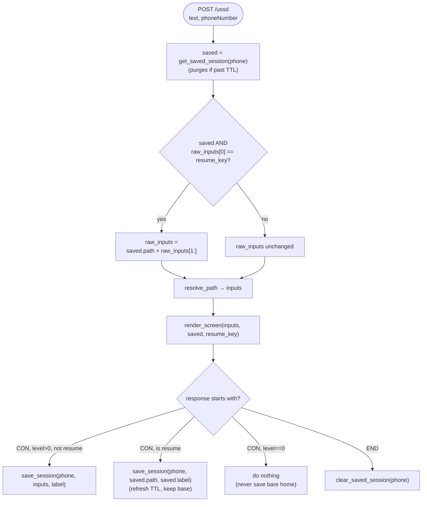
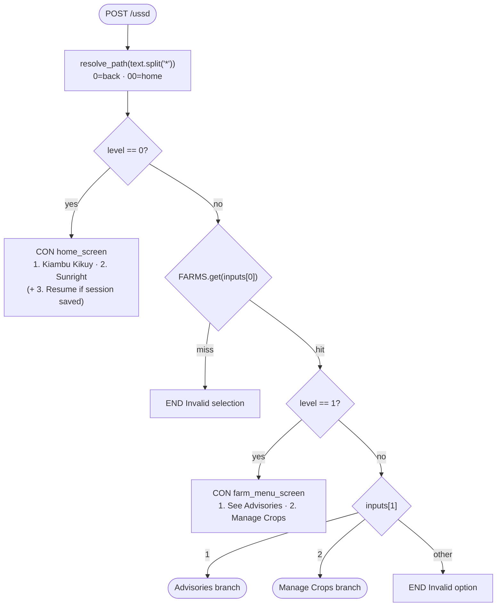
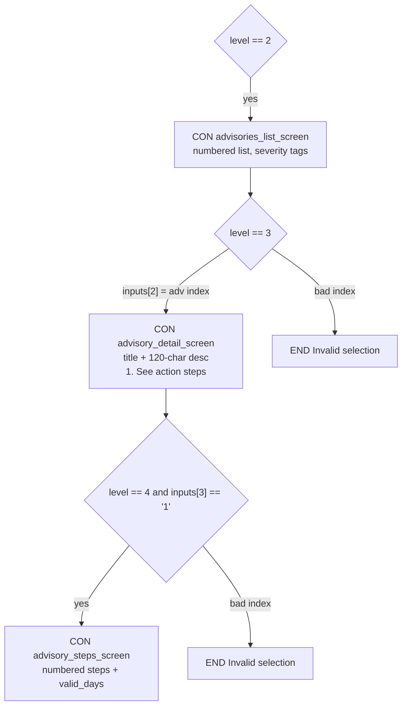
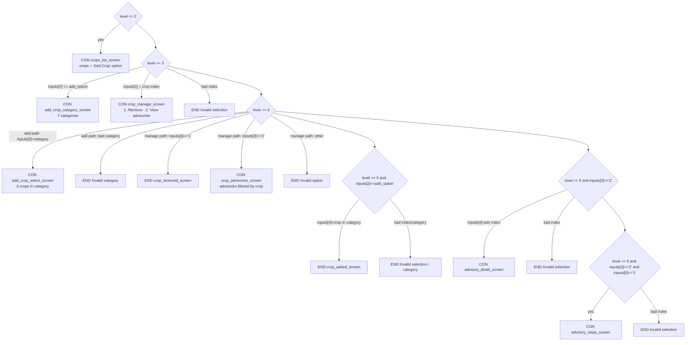

# USSD Flow

This document maps the complete menu tree implemented in `app.py`, derived from
`ussd_callback()`, `render_screen()`, and the screen renderer functions.

## Request handling: wrapper + pure router

The route handler is split into two layers:

- **`ussd_callback()`** — thin wrapper bound to `POST /ussd`. Reads `text` and
  `phoneNumber`, applies the **session-resume** logic (below), delegates to
  `render_screen()`, then **saves or clears** the session based on the response.
- **`render_screen(inputs, saved, resume_key)`** — pure function with no session
  side effects. Maps a resolved `inputs` list to a `CON`/`END` string. This is
  the menu tree the diagrams below describe.

## How to read this

- **`level`** = number of resolved inputs (`len(inputs)`), *after* `resolve_path()`
  has consumed any `0` (back) / `00` (home) tokens.
- **`inputs[n]`** = the value at each position of the resolved path.
- **CON** = session continues (menu shown). **END** = session terminates.
- Because `0`/`00` are consumed before routing, they are shown as global
  navigation, not per-screen edges — they simply shorten the path and re-render
  an earlier screen.

## Branch keys

| Position | Meaning |
|----------|---------|
| `inputs[0]` | Farm key (`1` Kiambu Kikuy, `2` Sunright) |
| `inputs[1]` | Farm menu choice (`1` Advisories, `2` Manage Crops) |
| `inputs[2]` | Advisory index **or** crop index / Add-Crop sentinel |
| `inputs[3]` | `1` See steps (advisories) **or** crop action / category key |
| `inputs[4]` | Crop-in-category index **or** crop-specific advisory index |
| `inputs[5]` | `1` See steps (crop-specific advisory) |

> **Note — dynamic "Add Crop" option:** in the Manage Crops branch, the sentinel
> `add_option = str(len(crops) + 1)`. For Kiambu (3 crops) it is `4`; for Sunright
> (2 crops) it is `3`. The same digit routes differently per farm.

## Session resume (cross-dial-in)

USSD is stateless within a call — `text` replays the whole input history. On top
of that, `app.py` adds **inter-session** resume so a caller who hangs up mid-flow
can pick up on the exact screen they left on a *later* dial-in.

- **Store:** `ACTIVE_SESSIONS`, an in-memory dict keyed by `phoneNumber`. Each
  entry holds the resolved `path`, a human-readable `label`, and `saved_at`.
  Lost on server restart; not shared across worker processes (POC trade-off).
- **TTL:** `SESSION_TTL_SECONDS` (default `50000`). `get_saved_session()` lazily
  purges expired entries on access. This is **not** the live USSD call timeout
  (network-defined, ~20–180s) — it governs how long a saved screen stays
  resumable across calls.
- **Save / clear:** the wrapper saves the current path on any `CON` response
  (except the bare home screen) and clears it on any `END`.
- **Resume key:** `resume_key = str(len(FARMS) + 1)` (currently `3`). It is the
  menu slot after the farms. The home screen lists it **last** (display order
  `1, 2, 3`) but the key is independent of display order — routing only checks
  `raw_inputs[0] == resume_key`.
- **Splice:** when the caller picks Resume, the wrapper rewrites
  `raw_inputs = saved["path"] + raw_inputs[1:]` *before* `resolve_path()`. Africa's
  Talking keeps resending the resume key as the first token on every subsequent
  request, so the splice re-applies on each hop, and the saved base is re-saved
  unchanged to keep it stable.

## Top-level routing

## Advisories branch — `inputs[1] == "1"`

## Manage Crops branch — `inputs[1] == "2"`

`add_option = str(len(crops) + 1)` is the "Add Crop" sentinel at `inputs[2]`.

## Path examples

| Resolved `text` | Screen reached |
|-----------------|----------------|
| *(empty)* | Farm list (home) |
| `1` | Kiambu farm menu |
| `1*1` | Kiambu advisories list |
| `1*1*3` | 3rd advisory detail |
| `1*1*3*1` | 3rd advisory action steps |
| `1*2` | Kiambu crops list |
| `1*2*4` | Add Crop → category list (Kiambu: `add_option == 4`) |
| `1*2*4*5*1` | Added "Avocado" (Fruits → first crop) — `END` |
| `1*2*1*1` | Removed crop #1 — `END` |
| `1*2*1*2*1*1` | Crop #1 → its advisories → 1st advisory → steps |
| `1*1*0` | Back from advisories list → Kiambu farm menu |
| `1*1*3*00` | Home from advisory detail → farm list |

### Resume examples

These assume a session was saved on a prior dial-in (`resume_key == 3`). The
wrapper splices the saved path in before routing.

| Prior saved path | This dial's `text` | Effect |
|------------------|--------------------|--------|
| `["1","2","4"]` (Add Crop) | `3` | Resume → Add Crop category list |
| `["1","2","4"]` | `3*4` | Resume, then pick Vegetables → crop list |
| `["1","2","4"]` | `3*4*2` | Resume → Vegetables → add Tomatoes — `END`, session cleared |
| `["1","1"]` (Advisories) | `3` | Resume → Kiambu advisories list |
| *(none / expired)* | `3` | No Resume shown; `3` is an invalid farm → `END` |

